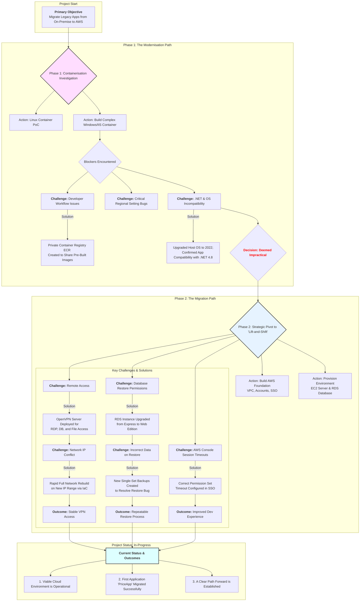

```mermaid
graph TD
    subgraph "Project Start"
        A[<b>Primary Objective</b><br/>Migrate Legacy Apps from On-Premise to AWS]
    end

    A --> B{Phase 1: Containerisation Investigation};

    subgraph "Phase 1: The Modernisation Path"
        style B fill:#fdf,stroke:#333,stroke-width:2px
        B --> C[Action: Linux Container PoC]
        B --> D[Action: Build Complex Windows/IIS Container]
        D --> E{Blockers Encountered}
        E --> F[<b>Challenge:</b> Developer Workflow Issues]
        F -- Solution --> F1[Private Container Registry ECR <br/>Created to Share Pre-Built Images]
        
        E --> G[<b>Challenge:</b> Critical Regional Setting Bugs]
        
        E --> H[<b>Challenge:</b> .NET & OS Incompatibility]
        H -- Solution --> H1[Upgraded Host OS to 2022;<br/>Confirmed App Compatibility with .NET 4.8]

        H --> I{<font color=red><b>Decision: Deemed Impractical</b></font>};
    end

    I --> J{Phase 2: Strategic Pivot to 'Lift-and-Shift'};

    subgraph "Phase 2: The Migration Path"
        style J fill:#e6f3ff,stroke:#333,stroke-width:2px
        J --> K[Action: Build AWS Foundation<br/>VPC, Accounts, SSO]
        J --> L[Action: Provision Environment<br/>EC2 Server & RDS Database]
        
        subgraph "Key Challenges & Solutions"
            M[<b>Challenge:</b> Remote Access] -- Solution --> MA[OpenVPN Server Deployed for<br/>RDP, DB, and File Access] --> N[<b>Challenge:</b> Network IP Conflict]
            N -- Solution --> N1[Rapid Full Network Rebuild<br/>on New IP Range via IaC] --> O[<b>Outcome:</b> Stable VPN Access]
            
            P[<b>Challenge:</b> Database Restore Permissions] -- Solution --> PA[RDS Instance Upgraded<br/>from Express to Web Edition] --> Q[<b>Challenge:</b> Incorrect Data on Restore]
            Q -- Solution --> Q1[New Single-Set Backups Created<br/>to Resolve Restore Bug] --> R[<b>Outcome:</b> Repeatable Restore Process]
            
            S[<b>Challenge:</b> AWS Console Session Timeouts] -- Solution --> SA[Correct Permission Set<br/>Timeout Configured in SSO] --> T[<b>Outcome:</b> Improved Dev Experience]
        end

        J --> M
        J --> P
        J --> S
    end

    O & R & T --> U[<b>Current Status & Outcomes</b>];

    subgraph "Project Status: In-Progress"
        style U fill:#dff,stroke:#333,stroke-width:2px
        U --> V[1. Viable Cloud Environment is Operational]
        U --> W[2. First Application 'PriceApp' Migrated Successfully]
        U --> X[3. A Clear Path Forward is Established]
    end
```
