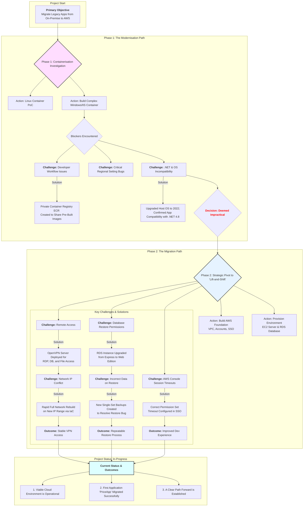

### **Project Summary: Legacy Application Cloud Migration**

#### **1. Primary Objective**

To migrate a suite of critical legacy applications from an aging, on-premise server to a modern, stable, and secure cloud environment on AWS. The immediate driver was the need to decommission the old hardware and establish a sustainable platform for the future.

---

#### **2. Phase 1: The Containerization Investigation**

*   **Objective:** To explore modernising the applications by containerising them, aiming for improved portability, consistency, and streamlined deployments.
*   **Actions:**
    *   A proof-of-concept was developed using a Linux container to introduce the workflow.
    *   Efforts were focused on building a Windows container with IIS to support a mix of .NET Frameworks and .NET Core runtimes.
*   **Outcome & Key Learning:**
    *   This approach was deemed impractical for the project's immediate timeline. It introduced significant technical blockers, including long and complex Docker builds, dependency conflicts, and issues with server regional settings that broke application functionality. The strategy, while valuable for future projects, was not the right fit for this urgent migration.

---

#### **3. Phase 2: The Strategic Pivot to a "Lift-and-Shift" Migration**

*   **Objective:** To meet the primary goal quickly and reliably, the strategy shifted to replicating the existing server environment in the cloud (a "lift-and-shift" approach). The priority became stability and speed of migration over immediate modernisation.
*   **Actions:**
    *   **Building the Foundation:** A secure and scalable AWS infrastructure was built from the ground up, including best practice structures, Single Sign-On (SSO) for the team, and a new network (VPC).
    *   **Provisioning the Environment:** A Windows virtual server (EC2) was provisioned to host the applications, and a managed SQL Server database (RDS) was created.
    *   **Solving Connectivity Challenges:** Secure VPN access for the development team was established. This process involved troubleshooting network routing issues, requring a full rebuild of the cloud network to resolve an IP address conflict.
    *   **Establishing a Data Migration Process:** A method for backing up on-premise databases and restoring them to the cloud RDS instance was developed. This involved troubleshooting and solving an issue where RDS was restoring incorrect data due to the format of the backup files.

---

#### **4. Current Status & Outcomes**

*   **A Viable Cloud Environment is Operational:** The core achievement is the successful creation of a stable and secure development environment in AWS that mirrors the legacy setup. The foundational infrastructure is in place.
*   **The First Application is Migrated:** The team has successfully deployed the first legacy application ("PriceApp") onto the new server, where it is running and connected to the migrated database. This serves as a successful proof-of-concept for the new architecture.
*   **A Clear Path Forward:** A repeatable, validated process for migrating the remaining application databases has been established.
*   **Project In-Progress:** While the ultimate goal has not yet been reached, many technical blockers have been overcome. The project has a clear path to migrating the remaining applications and decommissioning the old server.

